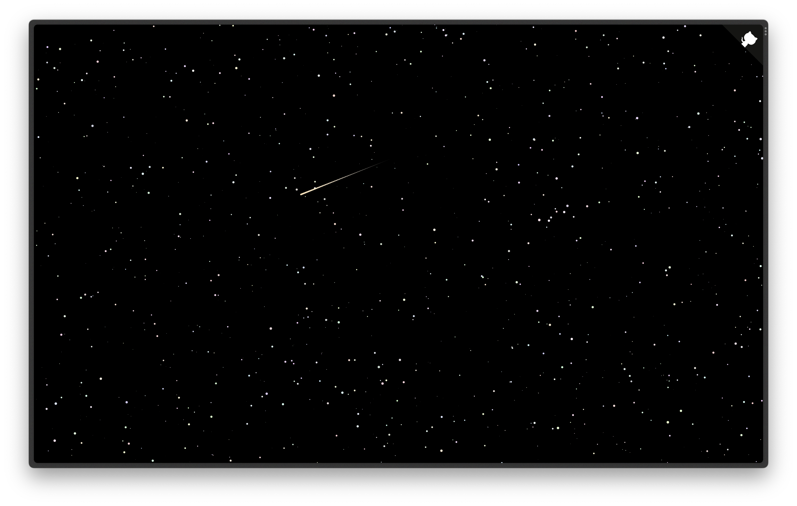

# 🌌 night-skies

Starry-sprinkled night skies with a chance of shooting stars and Lo-fi beats.

## About
[Night skies](https://night-skies.vercel.app/) is a small website created with Vite.js and the P5.js library that includes a starry night sky and random shooting stars and some lo-fi beats! 

## Contributing

This project is **_not_ accepting major contributions** as it is personal. However, if there is an issue — like a spelling or grammatical error, a visual bug, or other kinds of weird things happening — please feel free to [create an issue](https://github.com/jzaleta/night-skies/issues/new).

If you would like to leave comments about the source code — like possible design and code improvements, or other kinds of feedback — please feel free to [create an issue](https://github.com/jzaleta/night-skies/issues/new) too if you wish!

## License

This repository is made open-source with the [MIT License](LICENSE), meaning that you are allowed to modify and distribute the source code as well as use it for private and commercial use provided that the licence and copyright notices are retained. For more information, visit the link above to learn what is permitted by the licence.
