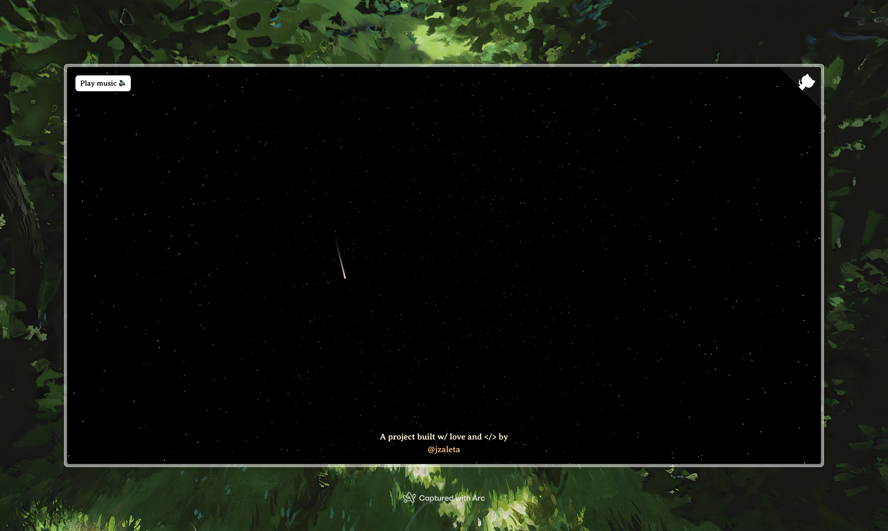

# ✨ night-skies

A web experience I crafted using SvelteKit for the frontend and Three.js with Threlte for the 3D graphics.

_Here's what it does:_

- Renders a dynamic starfield with stars and occasional shooting stars
- Plays lofi beats in the background

> ###### 🎧 Lofi Classical - Satie's Gymnopédie No. 1

# 📄 License

This project is made open-source with the [MIT License](LICENSE).
